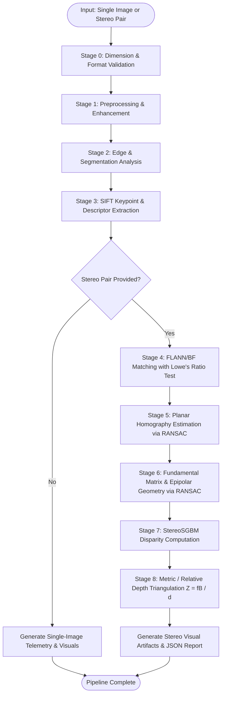

# CV-Scope Pipeline Workflow & Mathematical Foundations

This document provides a comprehensive academic guide to the theoretical principles, mathematical formulations, and design rationales underlying the **CV-Scope** analysis pipeline.

---

## 1. Pipeline Execution Flow



---

## 2. Mathematical Formulations by Stage

### Stage 1: Preprocessing & Contrast Enhancement

#### 1.1 Grayscale Conversion (Rec. 601 Luma Formula)
Human visual perception exhibits non-uniform spectral sensitivity, with peak sensitivity in green wavelengths. Grayscale luminance $Y$ is computed from linear RGB coordinates:
$$Y = 0.299 \cdot R + 0.587 \cdot G + 0.114 \cdot B$$

#### 1.2 2D Gaussian Filtering (Linear Denoising)
To attenuate high-frequency additive sensor noise, the image is convolved with an isotropic 2D Gaussian distribution kernel:
$$G(x, y) = \frac{1}{2\pi \sigma^2} \exp\left( -\frac{x^2 + y^2}{2\sigma^2} \right)$$
Discrete convolution: $I_{\text{smooth}}(x, y) = (I * G)(x, y)$.

#### 1.3 Median Filtering (Non-Linear Denoising)
For impulse (salt-and-pepper) noise, linear filters blur sharp boundaries. The median filter replaces each pixel with the statistical median of its local window $\Omega$:
$$I_{\text{median}}(x, y) = \operatorname{median} \{ I(x + u, y + v) \mid (u, v) \in \Omega \}$$

#### 1.4 Global Histogram Equalization
Transforms the pixel intensity probability density function $p_r(r_k) = \frac{n_k}{N}$ to linearize the cumulative distribution function (CDF):
$$s_k = T(r_k) = (L - 1) \sum_{j=0}^{k} p_r(r_j) = \frac{L - 1}{N} \sum_{j=0}^{k} n_j$$
where $L=256$ is the total discrete gray levels.

#### 1.5 Contrast Limited Adaptive Histogram Equalization (CLAHE)
Global equalization over-amplifies background noise in homogeneous regions. CLAHE operates on contextual grid tiles (e.g., $8 \times 8$). It enforces a maximum clip limit $\beta$ on the histogram:
$$h_{\text{clipped}}(k) = \min(h(k), \beta)$$
Clipped pixels are uniformly redistributed across all histogram bins, and tile boundaries are blended using bilinear interpolation to eliminate blocking artifacts.

#### 1.6 Unsharp Masking (High-Frequency Convolution)
Amplifies fine detail by adding a scaled high-pass Laplacian component to the original image:
$$I_{\text{sharp}} = I + \alpha \cdot (I - I_{\text{Gaussian}})$$
where $\alpha \ge 0$ is the sharpening strength multiplier.

---

### Stage 2: Edge & Segmentation Analysis

#### 2.1 Sobel Spatial Derivatives & Gradient Field
Approximates first-order horizontal and vertical spatial derivatives using discrete $3 \times 3$ convolution kernels:
$$S_x = \begin{bmatrix} -1 & 0 & +1 \\ -2 & 0 & +2 \\ -1 & 0 & +1 \end{bmatrix}, \quad S_y = \begin{bmatrix} -1 & -2 & -1 \\ 0 & 0 & 0 \\ +1 & +2 & +1 \end{bmatrix}$$
$$G_x = I * S_x, \quad G_y = I * S_y$$
The gradient magnitude $M(x, y)$ and direction $\theta(x, y)$ are given by:
$$M(x, y) = \sqrt{G_x(x, y)^2 + G_y(x, y)^2}, \quad \theta(x, y) = \operatorname{atan2}(G_y, G_x)$$

#### 2.2 Canny Edge Detection (4-Stage Algorithm)
1. **Gaussian Smoothing**: Suppresses noise prior to derivative estimation.
2. **Gradient Estimation**: Computes directional gradients $G_x, G_y$.
3. **Non-Maximum Suppression (NMS)**: Thins edge ridges by preserving only local maxima along the gradient normal vector $\theta$.
4. **Hysteresis Dual-Thresholding**: Employs two thresholds $T_{\text{low}}$ and $T_{\text{high}}$:
   - If $M(x, y) \ge T_{\text{high}}$, the pixel is marked as a **strong edge**.
   - If $T_{\text{low}} \le M(x, y) < T_{\text{high}}$, it is marked as a **weak edge**.
   - Weak edges are retained if and only if they are topologically connected to strong edges via 8-connectivity.

#### 2.3 Otsu Optimal Thresholding
Computes the global binary threshold $t^*$ that maximizes the inter-class variance $\sigma_B^2(t)$:
$$\sigma_B^2(t) = \omega_0(t) \omega_1(t) \left[ \mu_0(t) - \mu_1(t) \right]^2$$
where $\omega_0, \omega_1$ are the class probabilities of foreground and background, and $\mu_0, \mu_1$ are the class mean intensities.

---

### Stage 3 & 4: SIFT Feature Extraction & Matching

#### 3.1 Scale-Space Extrema (Difference of Gaussians)
Scale invariance is achieved by constructing an octave pyramid of Gaussian smoothed images $L(x, y, \sigma) = G(x, y, \sigma) * I(x, y)$. Scale-space extrema are detected in Difference-of-Gaussians (DoG) volumes:
$$D(x, y, \sigma) = L(x, y, k\sigma) - L(x, y, \sigma)$$
Keypoints are candidate extrema compared against their 26 spatio-temporal neighbors across current, upper, and lower scale levels.

#### 3.2 128-Dimensional SIFT Descriptor
A $16 \times 16$ pixel neighborhood around the keypoint is partitioned into sixteen $4 \times 4$ subregions. In each subregion, gradient orientations are accumulated into an 8-bin histogram weighted by gradient magnitude and a Gaussian window centered at the keypoint:
$$16 \text{ subregions} \times 8 \text{ orientation bins} = 128\text{-dimensional vector}$$
The descriptor vector is normalized to unit Euclidean length ($\|d\|_2 = 1$), clipped at $0.2$ to minimize non-linear illumination variations, and re-normalized.

#### 3.3 Lowe's Ratio Test
For each query descriptor $d_q$, the two nearest neighbors $d_{\text{best}}$ and $d_{\text{second}}$ in the target image are retrieved:
$$\text{Ratio} = \frac{\|d_q - d_{\text{best}}\|_2}{\|d_q - d_{\text{second}}\|_2} < \tau \quad (\tau = 0.75)$$
Matches failing this threshold are discarded, rejecting false matches caused by repetitive patterns or non-distinctive background texture.

---

### Stage 5: Planar Homography & Projective Geometry

#### 5.1 Projective Transformation Matrix
A homography $H \in \mathbb{R}^{3 \times 3}$ relates corresponding coplanar points between two projective views in homogeneous coordinates:
$$\mathbf{x}_2 \sim H \mathbf{x}_1 \implies \begin{bmatrix} x_2 \\ y_2 \\ 1 \end{bmatrix} \sim \begin{bmatrix} h_{11} & h_{12} & h_{13} \\ h_{21} & h_{22} & h_{23} \\ h_{31} & h_{32} & h_{33} \end{bmatrix} \begin{bmatrix} x_1 \\ y_1 \\ 1 \end{bmatrix}$$
Since $H$ is defined up to an arbitrary non-zero scale factor, it possesses 8 degrees of freedom, requiring a minimum of 4 non-collinear point pairs.

#### 5.2 RANSAC Estimation & Inlier Consensus
RANSAC iteratively samples minimal 4-point subsets, solves $A \mathbf{h} = \mathbf{0}$ via Singular Value Decomposition (SVD), and evaluates the Euclidean reprojection error:
$$e_i = \left\| \mathbf{x}_{2, i} - \frac{H \mathbf{x}_{1, i}}{(H \mathbf{x}_{1, i})_z} \right\|_2 < \delta_{\text{reproj}}$$
The homography with the largest consensus set of inliers is re-estimated over all inliers.

---

### Stage 6: Epipolar Geometry & Fundamental Matrix

#### 6.1 The Epipolar Constraint
For general non-planar 3D scenes observed by two calibrated or uncalibrated cameras, the epipolar geometry is encapsulated by the $3 \times 3$ Fundamental Matrix $F$:
$$\mathbf{x}_2^T F \mathbf{x}_1 = 0$$
where $F = K_2^{-T} [t]_\times R K_1^{-1}$, $\operatorname{rank}(F) = 2$, and $\det(F) = 0$.

#### 6.2 Conjugate Epipolar Lines
The epipolar line $\mathbf{l}_2$ in the second image corresponding to point $\mathbf{x}_1$ in the first image is given by:
$$\mathbf{l}_2 = F \mathbf{x}_1 = [a, b, c]^T \implies a x + b y + c = 0$$
Similarly, the epipolar line in the first image corresponding to $\mathbf{x}_2$ is:
$$\mathbf{l}_1 = F^T \mathbf{x}_2$$

---

### Stage 7 & 8: Stereo Disparity & Triangulation Depth

#### 7.1 Semi-Global Block Matching (StereoSGBM)
StereoSGBM minimizes the 2D Markov Random Field (MRF) energy functional $E(D)$ across 1D scanning paths $r$:
$$E(D) = \sum_{\mathbf{p}} C(\mathbf{p}, D_{\mathbf{p}}) + \sum_{\mathbf{q} \in \mathcal{N}_{\mathbf{p}}} P_1 \cdot \mathbb{I}(|D_{\mathbf{p}} - D_{\mathbf{q}}| = 1) + \sum_{\mathbf{q} \in \mathcal{N}_{\mathbf{p}}} P_2 \cdot \mathbb{I}(|D_{\mathbf{p}} - D_{\mathbf{q}}| > 1)$$
where:
- $C(\mathbf{p}, D_{\mathbf{p}})$ is the Birchfield-Tomasi pixel matching cost at disparity $D_{\mathbf{p}}$.
- $P_1$ penalizes small disparity variations (smooth surfaces).
- $P_2$ penalizes large disparity jumps ($P_2 > P_1$, preserving sharp depth discontinuities).

#### 7.2 Disparity to Metric Depth Triangulation
From the geometry of identical canonical pinhole stereo cameras with optical axes parallel and separated by baseline $B$:

```
        3D Object Point P(X, Y, Z)
                 /\
                /  \
               /    \
              /      \
             /        \
            /          \
  Left Focal Plane    Right Focal Plane
      |----x_l----|        |----x_r----|
      |<--- f --->|        |<--- f --->|
      Camera 1 (Left)      Camera 2 (Right)
      O1 <------------ B ------------> O2
```

Using similar triangles:
$$\frac{x_l}{f} = \frac{X}{Z}, \quad \frac{-x_r}{f} = \frac{B - X}{Z} \implies \frac{x_l - x_r}{f} = \frac{B}{Z}$$
Defining horizontal disparity $d = x_l - x_r$:
$$d = \frac{f \cdot B}{Z} \iff Z = \frac{f \cdot B}{d}$$
- **$Z$**: Perceived depth along optical axis (meters).
- **$f$**: Camera focal length (pixels).
- **$B$**: Stereo baseline distance (meters).
- **$d$**: Measured horizontal pixel disparity ($d > 0$).

---

## 3. Algorithmic Design Decisions & Justification

| Selected Algorithm | Alternative Considered | Technical Rationale for Selection |
| :--- | :--- | :--- |
| **SIFT** | ORB, Harris Corner | SIFT provides full scale-invariance via DoG pyramid and rotation invariance via orientation histograms. ORB is faster but less robust under large scale shifts and perspective changes. |
| **RANSAC** | Least Squares | Standard Least Squares fails catastrophically when false correspondences exist. RANSAC guarantees robust model fitting in the presence of up to 50%+ outlier matches. |
| **Canny** | Simple Sobel threshold | Canny applies directional non-maximum suppression and hysteresis with dual thresholds, producing single-pixel thin continuous boundaries rather than thick gradient bands. |
| **StereoSGBM** | StereoBM (Local block) | Simple Block Matching suffers from aperture ambiguity in low-texture areas and window-border artifacts. StereoSGBM enforces multi-directional 1D dynamic programming smoothness, preserving sharp structural depth edges. |
| **CLAHE** | Global Histogram Eq. | Global equalization frequently saturates high-brightness regions and amplifies background sensor noise. CLAHE restricts local contrast amplification to bounded tiles. |
